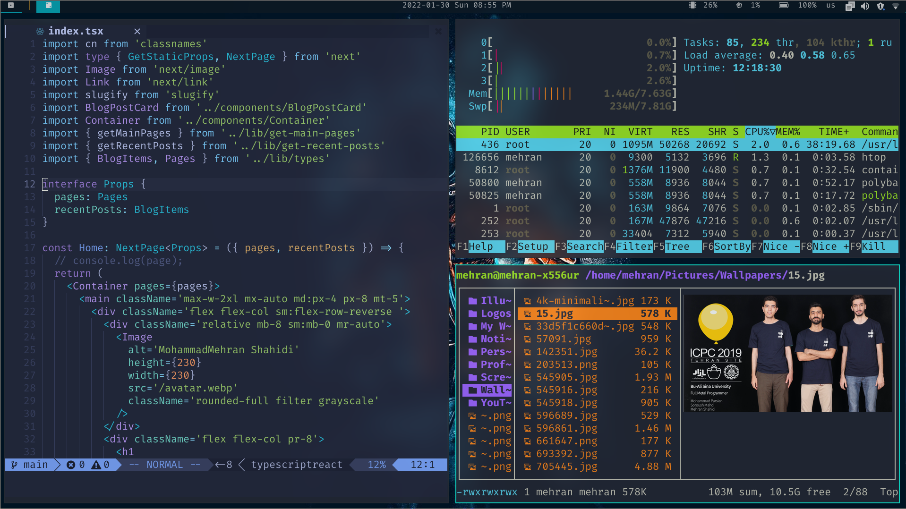

# .dotfiles
This repo is where I keep my config files and instructions to install them.
I am using Manjaro-i3 as my operating system. Take note that some of these configs 
like i3 might be specific to my OS, while others can be applied to other OSs, as well (Windows users should use [WSL](https://docs.microsoft.com/en-us/windows/wsl/install)).

`I am using GNU stow to manage my dotfiles. If you don't know about it, I have a blog post to help you `
=> [mehranshahidi.ir/blog/why-dotfiles-how-to-manage-them](https://www.mehranshahidi.ir/blog/why-dotfiles-how-to-manage-them)
## Installation 
1. Install [gh](https://github.com/cli/cli/blob/trunk/docs/install_linux.md)
2. Signup using `gh auth login` ( not necessary for the server)
3. Clone the repo in the home directory
5. Install [fish](fish) 
6. Add AUR to Manjaro (OS specific)
7. Install Fira code nerd font (It's inside AUR repo)
8. Install [nvim](nvim)

## Tools I am using
- [Kitty](https://sw.kovidgoyal.net/kitty/): Graphics processing unit-accelerated terminal emulator for Linux and macOS
- [Fish](https://fishshell.com/): Unix shell with a focus on interactivity and usability
- [Neovim](https://neovim.io/): Enable new applications without compromising Vim's traditional roles
- [Picom](https://github.com/yshui/picom): A lightweight compositor for X11
- [Polybar](https://github.com/polybar/polybar): Customizable status bar
- [Ranger](https://github.com/ranger/ranger): File manager with text-based user interface for Unix-like systems
- [Starship](https://starship.rs/): Minimal, blazing fast, and extremely customizable prompt for any shell!
- [Tmux](https://github.com/tmux/tmux/wiki): Terminal multiplexer for Unix-like operating systems
- [i3](https://i3wm.org/): Tiling window manager designed for X11
- [Lazygit](https://github.com/jesseduffield/lazygit): Simple terminal UI for git commands
- [FiraCode Nerd Font](https://github.com/ryanoasis/nerd-fonts/tree/master/patched-fonts/FiraCode): Patches developer targeted fonts with a high number of glyphs (icons)
- [Tokyo Night Theme](https://github.com/folke/tokyonight.nvim): A dark and light Neovim theme
