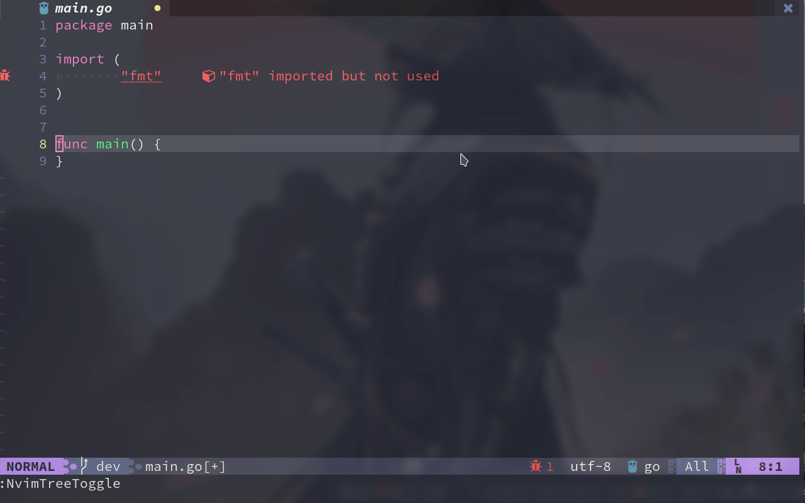

# Neovim


## Prerequisite
1. Install Neovim following [here](https://github.com/neovim/neovim/wiki/Installing-Neovim)
2. Run `stow nvim` inside the `.dotfiles` directory (it will copy it nvim conifg to `~/.config/nvim/`)
3. Install [ripgrep](https://github.com/BurntSushi/ripgrep#installation)
4. Install all language dependencies that suit you
### Language support
- Go
    1. Install Go [go.dev/doc/install](https://go.dev/doc/install)
    2. When you open up neovim use following command `:GoInstallBinaries` to install dependencies for `go.nvim` package
- Typescript
    1. Install [fnm](https://github.com/Schniz/fnm) for a fast and simple Node.js version manager, built in Rust
    2. Install following dependencies
        ```bash
            fnm install --lts # install latest long-term support node
            npm install -g typescript typescript-language-server eslint @fsouza/prettierd yarn vscode-languageserver
        ```
- Rust: 
    1. Install rust and cargo [www.rust-lang.org/tools/install](https://www.rust-lang.org/tools/install)
- Lua: 
    1. Install lua-language-server using these [instructions](https://github.com/neovim/nvim-lspconfig/blob/master/doc/server_configurations.md#sumneko_lua)
    2. To support formatting on Buffer Write for lua files install the following package with cargo (or comment out BufWritePre *.lua [autocommands.lua](.config/nvim/lua/user/autocommands.lua))
       ```bash
       cargo install stylua
       ```
       
